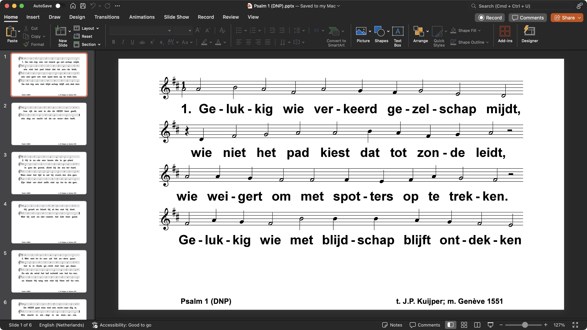

I’ve worked with several community team members from churches that use PowerPoint to present the lyrics of their hymns and songs. These slides contain the lyrics along with music notation above them. Most of the time, the entire slide is an image, with a textbox containing metadata below it, separate from the image.

An example of a presentation might look like this:



I noticed that they were manually inverting these presentations from black-on-white to white-on-black by extracting each image, pasting it into an external program, inverting it, and then pasting it back into the slide. After that, they would adjust the text colors for each slide and save the file.

This process had to be repeated for hundreds of presentations.

With my developer optimism, I thought I could automate it. And I did. And failed. But then succeeded.

I came across a Python library called [python-pptx](), which allows for easy modification of existing PowerPoints.

Leaving all the CLI argument parsing for another time, here’s how I loaded the PowerPoint and processed it.

We read the file into memory and pass it to the `invert_presentation` function.

```python
with open(input_path, "rb") as f:
    inverted_pptx = invert_presentation(f)
```

This function takes the bytes and creates a `Presentation` object using `python-pptx`. After that, it's very easy to loop over each slide and make modifications.

```python
def invert_presentation(bytes_data):
    """Inverts colors in a PowerPoint presentation"""
    presentation = Presentation(bytes_data)

    for slide in presentation.slides:
        # 1. Invert slide background
        # 2. Invert images
        # 3. Invert other shapes (text elements)

    output = BytesIO()
    presentation.save(output)
    return output.getvalue()
```

For example, in just two lines, we can change the background color:

```python
slide.background.fill.solid()
slide.background.fill.fore_color.rgb = RGBColor(0, 0, 0)
```

### Extracting and Inverting Images

Next, I had to figure out how to extract images from the PowerPoint. The library didn’t have good documentation on how to extract an image and reinsert it after processing. At first, I tried converting the `.pptx` file to a `.zip` archive, where images are stored as actual files. This worked but required a lot of code for extracting, processing, and reinserting the images. With some help from ChatGPT, I found a much simpler way.

Each slide contains a list of shapes, which we can filter to find only images:

```python
for shape in list(slide.shapes):
    if shape.shape_type == MSO_SHAPE_TYPE.PICTURE:
        process_image(shape, slide)
```

Each image shape has access to its image data (blob), which we can read and process. For image inversion, I used the `Pillow` library, which is a popular library for handling image processing.

```python
def process_image(shape, slide):
    """Process and invert a single image shape"""
    image_stream = BytesIO(shape.image.blob)
    with managed_image(image_stream) as img:
        if img.mode not in ("RGB", "RGBA"):
            img = img.convert("RGB")
        inverted_img = ImageOps.invert(img)
        img_stream = BytesIO()
        inverted_img.save(img_stream, format="PNG")
        img_stream.seek(0)

        # Store shape properties before removal
        left, top = shape.left, shape.top
        width, height = shape.width, shape.height

        # Remove old shape and add new one
        slide.shapes._spTree.remove(shape._element)
        slide.shapes.add_picture(img_stream, left, top, width, height)
```

### Inverting Text Colors

Finally, the remaining task was to adjust the text elements. This was as simple as modifying the background.

```python
for shape in list(slide.shapes):
    if shape.shape_type == MSO_SHAPE_TYPE.PICTURE:
        process_image(shape, slide)
    elif shape.has_text_frame:
        for paragraph in shape.text_frame.paragraphs:
            for run in paragraph.runs:
                # Set text color to white since the background is now black
                run.font.color.rgb = RGBColor(255, 255, 255)
```

And that’s it! What started as a tedious manual task turned into an automated solution with just a bit of Python magic. No more copy-pasting images, no more color adjustments slide by slide—just run the script and let it do the work. While this approach isn’t perfect (some images did work), it already saves hours (if not days) of effort.
